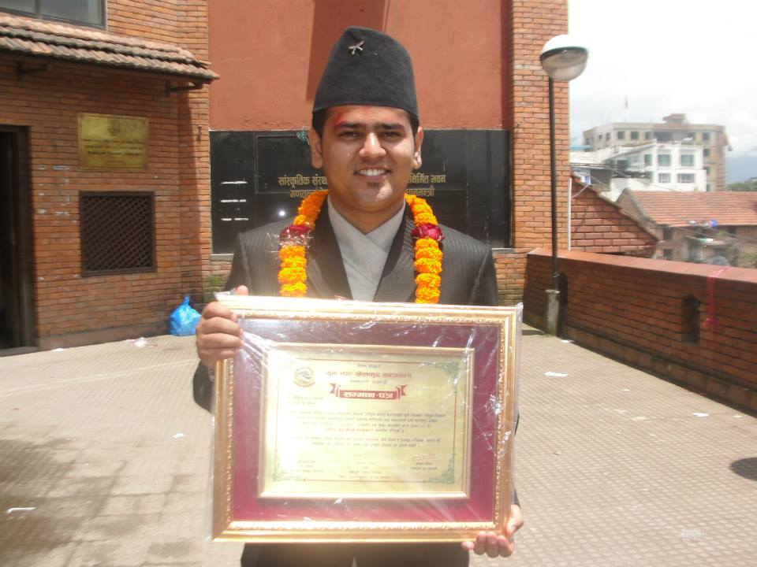
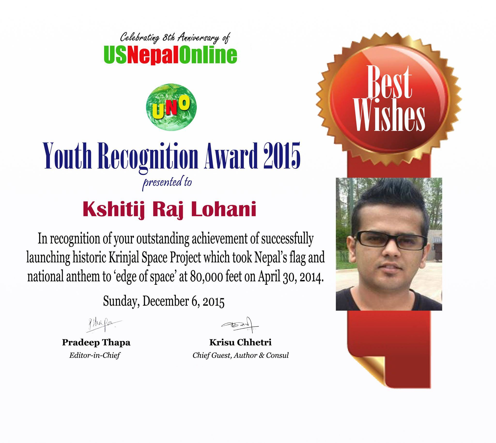

> **National Youth Award**

Date : August 12, 2014

Given By : Government of Nepal

Significance : 'National Youth Award' is the biggest honor given my Government of Nepal to any youth. This award is given annually.

---

> **Trustee Scholar**

Date : August 12, 2014

Given By : Northeastern University

Significance : Trustee Scholar is the highest honor undergrad scholarship given by Northeastern University to its incoming class.
It includes 100% free tuition, room and board. Its a full ride. It's awarded to top 1% of incoming class.

---

> **Youth Recognition Award**

Date : December 09, 2015

Given By : UsNepalOnline

Significance : UsNepalOnline awards 'Youth Recognition Award' to one youth annually for their contribution in US-Nepal community

> **National memorization record holder**

todo : tyo nepal telvision wala video chadai khojnu paryo for this

todo: ani certificate file ma bhako aru award pani scan garera ya halnu parnecha
