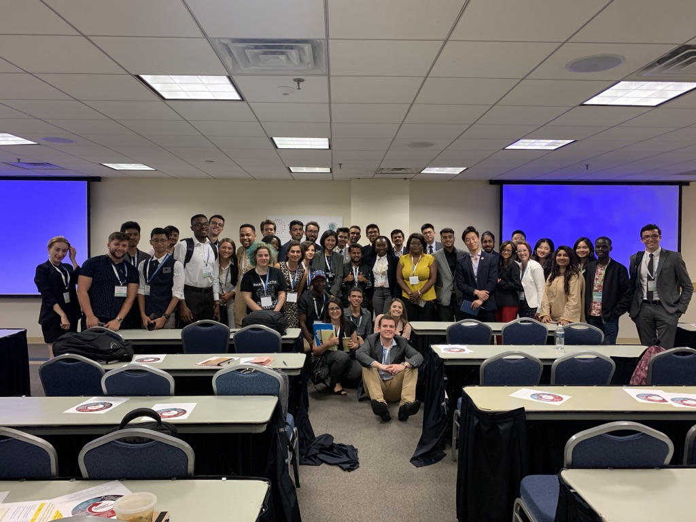
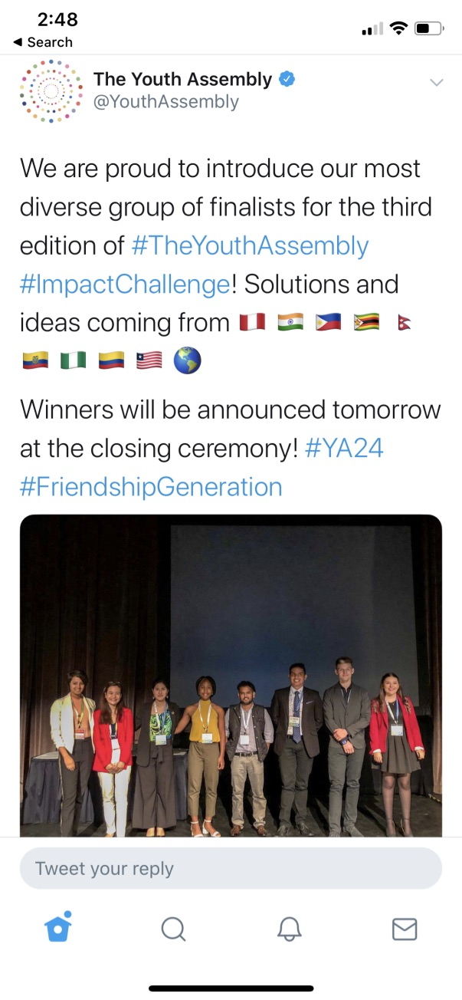

> **National Youth Award**

Date : August 12, 2014

Given By : Government of Nepal

Significance : 'National Youth Award' is the biggest honor given my Government of Nepal to any youth. This award is given annually.

---

> **Dintinguished Youth Speaker**

Date : August 10, 2019

Given By : UN Friendship Ambassador @ Youth Assembly

Significance : "Each session of The Youth Assembly, highly distinguished Youth Delegates are nominated from the Outstanding Youth Delegate candidate pool to serve as speakers at conference sessions. Distinguished Youth Speakers can share their work, ideas, and policy recommendations on their field of expertise." - Youth Assembly Team

---

> **Impact Challenge Finalist**

Date : August 10, 2019

Given By : UN Friendship Ambassador @ Youth Assembly

Significance : My idea got selected as the 'TOP 10' idea among the entire world. Applicants from all over the world submitted their idea related to Sustainable Development Goals.

---

> **Youth Recognition Award**

Date : December 09, 2015

Given By : UsNepalOnline

Significance : UsNepalOnline awards 'Youth Recognition Award' to one youth annually for their contribution in US-Nepal community

> **National memorization record holder**

Date : January 26, 2015

Given By : National Academy of Science and Technology, Maharsi Vedic Science and Technology

Significance : Previous National record before this was 90 words. i remembered 125 words by listening them only once.

> **Trustee Scholar**

Date : August 12, 2014

Given By : Northeastern University

Significance : Trustee Scholar is the highest honor undergrad scholarship given by Northeastern University to its incoming class.
It includes 100% free tuition, room and board. Its a full ride. It's awarded to top 1% of incoming class.

---
